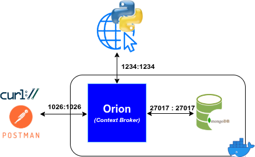
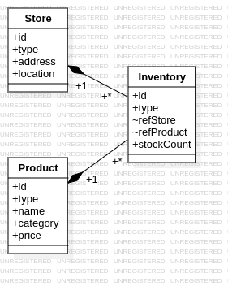

# Ejemplos de Subscripciones en NGSI-v2
Para este ejemplo simularemos un escenario de una tienda de alimentación que quiere gestionar la información de sus productos utilizando Fiware y NGSI-v2. La tienda tiene varios productos, cada uno con atributos como nombre, categoría, precio y cantidad en stock. Queremos realizar varias operaciones por lotes para gestionar estos productos de manera eficiente.

## Requisitos

- Tener un entorno Fiware con Orion Context Broker y MongoDB en funcionamiento.

- Herramienta para realizar peticiones HTTP, como Postman o cUrl.

- Herramienta `git` para clonar el repositorio con los ejemplos.


## Despliegue de la arquitectura necesaria
La arquiterctura que deberemos desplegar para la realización del ejemplo aquí tratado se muestra en la [Figura 1](#fig:architecture). En ella se puede ver como lo que necesitamos es un entorno básico de Fiware (Orion y MongoDB) y un pequeño servicio HTTP que actuará como receptor de las notificaciones de las suscripciones que demos de alta en Orion. En este caso el servicio HTTP está implementado en Python.

<a name="fig:architecture">
<figure>
    
    <figcaption align="center" size="tiny">Figura 1: Arquitectura Fiware</figcaption>
</figure>
</a>

Para el despliegue de la arquitectura, realizaremos los siguientes pasos:

### 1.-Clonar el repositorio con los ejemplos
En primer lugar, clonaremos el repositorio que contiene los ejemplos y nos situaremos en la rama `subscription`, que incluye un pequeño servicio HTTP para recibir las notificaciones de las suscripciones:

```bash
git clone https://github.com/franciscodelicado/Fiware-CRUD-example.git
cd Fiware-CRUD-example
git checkout subscription
```


### 2.- Despliegue del servicio HTTP para recibir notificaciones
Para comprobar las notificaciones de las suscripciones, usaremos un pequeño servicio HTTP implementado en Python. Para evitar problemas de dependencias, es recomendable usar un **entorno virtual de Python**, e instalar las dependencias necesarias. Para ello, realizaremos las siguientes acciones:

1. Instalar la versión de Python indicada en el fichero `scripts/.python-version`
2. Crear un entorno virtual de Python en la carpeta `scripts`:

```bash
cd scripts
python -m venv .venv
source .venv/bin/activate
pip install -r requirements.txt
```
Una vez hecho esto, ya podemos ejecutar el servicio HTTP que escuchará las notificaciones de las suscripciones:

```bash
$ python http_service.py
 * Serving Flask app 'http_service'
 * Debug mode: off
WARNING: This is a development server. Do not use it in a production deployment. Use a production WSGI server instead.
 * Running on all addresses (0.0.0.0)
 * Running on http://127.0.0.1:1234
 * Running on http://172.24.8.65:1234
Press CTRL+C to quit
```
Podemos comprobar que el servicio está expuesto en el puerto 1234, viendo los sockets TCP que están a la escucha en dicho puerto. Para ello, en un terminal del sistema podemos usar alguno de los siguientes comandos:

```bash
ss -ltnp | grep ':1234'          # Alternativa 1
sudo netstat -tlnp | grep ':1234' # Alternativa 2
```
Así ejecutando el primer comando:
```bash
$ ss -ltnp | grep ':1234'
LISTEN 0      128          0.0.0.0:1234       0.0.0.0:*    users:(("python",pid=288765,fd=3))
```
vemos que el servicio que tiene un `pid=288765` está escuchando en el puerto `1234` de todas las interfaces. Y, para ver qué servicio es exactamente, podemos usar el comando `ps`:

```bash
$ ps aux |grep "288765"
franman   288765  0.0  0.0  37804 30592 pts/2    S+   16:37   0:00 python http_service.py
franman   288132  0.0  0.0  11784  2304 pts/4    S+   16:51   0:00 grep 288765
```
viendo que efectivamente es el servicio que lanzamos con el comando `python http_service.py` es el que está a la escucha en el puerto `1234`.

Para comprobar el funcionamiento del servicio, si tenemos en cuenta que este lo único que hace es sacar por pantalla el contenido del mensaje HTTP de tipo POST que se realiza sobre el _endpoint_ `/subscription/attr-change`, podemos usar `curl` para enviar un mensaje de prueba:

```bash
curl -X POST 'http://localhost:1234/subscription/attr-change' \
-H 'Content-Type: application/json' \
-d '{
  "test": "This is a test message"
}'
```
lo que hará que en la consola donde tenemos el servicio HTTP en ejecución veamos el siguiente mensaje:

```
{
  "test": "This is a test message"
}
127.0.0.1 - - [08/Oct/2025 16:56:06] "POST /subscription/attr-change HTTP/1.1" 200 -
``` 
El mensaje se compone de dos partes, la primera es el contenido del mensaje JSON que hemos enviado, y la segunda es el log de Flask indicando que se ha recibido una petición POST en el _endpoint_ `/subscription/attr-change` y que se ha respondido con un código HTTP 200 (OK).


## 3.- Despliegue del entorno Fiware
Para desplegar un entorno Fiware con Orion y MongoDB, realizaremos una vez clonado el repositorio:
```bash
./services start
```

Esto desplegará los contenedores necesarios para ejecutar el entorno Fiware. Además de dar de alta en el sistema varias entidades que usaremos en el ejemplo. Estas representan distintos productos de alimentación, así como distintas tiendas y entidades que representan niveles de stock de los productos.

## Entidades desplegadas
Con el despliegue del entorno Fiware, se han dado de alta algunas entidades que representan productos de alimentación, tiendas y niveles de stock. La relación entre estas se muestra en el digrama de la [Figura 2](#fig:entitiesRelationship). En ella se puede ver como una entidad de inventario relaciona un producto con la tienda en la que se encuentra, además de indicar el número de unidades disponibles en stock. Por su parte el producto tiene como atributos su nombre, la categoría, que puede ser "lácteo", "fruta", "verdura", "carne" o "bebida", y el precio por unidad. La tienda tiene como atributos su nombre y la ubicación, que es un atributo de tipo `geo:json` que indica la posición geográfica de la tienda.

<a name="fig:entitiesRelationship">
  <figure>
    
    <figcaption align="center" size="tiny">Figura 2: Relación entre entidades</figcaption>
  </figure>
</a>

Si queremos ver las entidades que se han dado de alta en el sistema, podemos realizar una petición GET al endpoint `/v2/entities` de Orion:

```bash
curl -X GET 'http://localhost:1026/v2/entities?options=keyValues' \
-H 'Accept: application/json' | jq '.'
```

Esto devolverá un listado con todas las entidades que se han dado de alta en el sistema, junto con sus atributos y valores. Una sección de los mismos será la siguiente:

```json
[
   [
  {
    "id": "urn:ngsi-ld:Store:001",
    "type": "Store",
    "address": {
      "streetAddress": "C/ Octavio Cuartero, 4",
      "addressLocality": "Albacete",
      "postalCode": "02001",
      "addressCountry": "Spain"
    },
    "location": {
      "type": "Point",
      "coordinates": [
        -1.857033905,
        38.990913668
      ]
    }
  },
  ...
  {
    "id": "urn:ngsi-ld:Product:003",
    "type": "Product",
    "category": "Dairy",
    "name": "Milk",
    "price": 0.9
  },
  ....
  {
    "id": "urn:ngsi-ld:Inventory:004",
    "type": "Inventory",
    "refProduct": "urn:ngsi-ld:Product:001",
    "refStore": "urn:ngsi-ld:Store:002",
    "stockCount": 50
  },...
]
```

# Gestión de subscripciones en NGSI-v2
## Creación de una subscripción

Para crear una subscripción en NGSI-v2, debemos realizar una petición POST al endpoint `/v2/subscriptions` de Orion. La petición debe incluir un cuerpo en formato JSON que describa la subscripción que queremos crear. A continuación se muestra un ejemplo de cómo crear una subscripción que notifique cambios en el stock de todo producto cuando el número de artículos en stock pase a estar por debajo de 20. En este caso solo se notificará el atributo `stockCount` de la entidad que ha cambiado, y se incluirá en la notificación la metainformación de fecha de creación y modificación del atributo. la notificación se enviará al servicio HTTP desplegado en la IP 172.18.1.1 (IP del `gateway` de la red Docker que usa el contenedor de Orion) y puerto 1234, en el _endpoint_ `/subscription/attr-change`:

```bash
curl -X POST 'http://localhost:1026/v2/subscriptions' \
-H 'Content-Type: application/json' \
-d '{
  "description": "Notify me when stock is below 20  ",
  "subject": {
    "entities": [
      {
        "idPattern": "urn:ngsi-ld:Inventory:.*",
        "type": "Inventory"
      }
    ],
    "condition": {
      "attrs": [
        "stockCount"
      ],
      "expression": {
        "q": "stockCount<20"
      }
    }
  },
  "notification": {
    "http": {
      "url": "http://172.18.1.1:1234//subscription/attr-change"
    },
    "attrs": [
      "stockCount"
    ],
    "metadata": ["dateCreated", "dateModified"]
  },
  "throttling": 5
}
'
```
**NOTA**: es importantísimo el recalcar que dado que Orion está en un contenedor de Docker, y que el servicio HTTP que hemos desplegado para recibir las notificaciones está en el host, debemos usar como IP para la URL del campo `notification.http.url` la IP del host vista desde el contenedor de Docker. Para ello, hay que utilizar la IP del `gateway` de la red Docker que usa por el contenedor de Orion. Esta IP es la primera IP del rango direccionable de la red Docker. La dirección de esta red puede verse en el fichero `docker-compose.yml` que se usa para desplegar el entorno Fiware, en la sección `networks`. En nuestro caso, la red se llama `fiware_default` y tiene el rango `172.18.1.0/16`. Por lo tanto, la IP del `gateway` es `172.18.1.1`.

## Visualización de las subscripciones
Para ver las subscripciones que tenemos dadas de alta en Orion, podemos realizar una petición GET al endpoint `/v2/subscriptions`:
```bash
curl -X GET 'http://localhost:1026/v2/subscriptions' \
-H 'Accept: application/json' | jq '.'
```

Esto devolverá un listado con todas las subscripciones que tenemos dadas de alta en el sistema. Una sección de las mismas será la siguiente:

```json
[
  {
    "id": "68e68301f93ed8fda30232fb",
    "description": "Notify me when stock is below 20  ",
    "subject": {
      "entities": [
        {
          "idPattern": "urn:ngsi-ld:Inventory:.*",
          "type": "Inventory"
        }
      ],
      "condition": {
        "attrs": [
          "stockCount"
        ],
        "expression": {
          "q": "stockCount<20"
        }
      }
    },
    "notification": {
      "http": {
        "url": "http://172.18.1.1:1234//subscription/attr-change"
      },
      "attrs": [
        "stockCount"
      ],
      "metadata": ["dateCreated", "dateModified"]
    },
    "throttling": 5
  }
]
```

## Probando la subscripción
Para probar la subscripción que hemos creado, podemos realizar una operación de actualización (PATCH) sobre una entidad de inventario, cambiando el valor del atributo `stockCount` a un valor por debajo de 20. Por ejemplo, podemos actualizar el inventario con ID `urn:ngsi-ld:Inventory:001`, que inicialmente tiene un stock de 50 unidades del `apples` en la tienda de Octavio Cuartero,4 , a 15 unidades:
```bash
curl -X PATCH 'http://localhost:1026/v2/entities/urn:ngsi-ld:Inventory:001/attrs?options=keyValues' \
-H 'Content-Type: application/json' \
-d '{
  "stockCount": 15
}'
```
Al realizar esta operación, si todo está correcto, en la consola donde tenemos el servicio HTTP en ejecución veremos un mensaje similar al siguiente:

```
{
  "subscriptionId": "68e68301f93ed8fda30232fb",
  "data": [
    {
      "id": "urn:ngsi-ld:Inventory:001",
      "type": "Inventory",
      "stockCount": {
        "type": "Number",
        "value": 15,
        "metadata": {
          "dateCreated": {
            "type": "DateTime",
            "value": "2025-10-08T15:27:44.065Z"
          },
          "dateModified": {
            "type": "DateTime",
            "value": "2025-10-08T15:28:26.751Z"
          }
        }
      }
    }
  ]
}
172.18.1.3 - - [08/Oct/2025 17:28:26] "POST /subscription/attr-change HTTP/1.1" 200 -
```

## Creando otra subscripción
Podemos crear otra subscripción que se notifique cuando el precio del producto `Bread` cambie. Independientemente del valor que tome el precio. Para ello, enviaremos el siguiente POST al endpoint `/v2/subscriptions` de Orion:

```bash
curl -X POST 'http://localhost:1026/v2/subscriptions' \
-H 'Content-Type: application/json' \
-d '{
  "description": "Notify me when the price of Bread changes",
  "subject": {
    "entities": [
      {
        "idPattern": "urn:ngsi-ld:Product:002",
        "type": "Product",
        "name": "Bread"
      }
    ]
  },
  "notification": {
    "http": {
      "url": "http://172.18.1.1:1234//subscription/attr-change"
    },
    "attrs": [
      "price"
    ],
    "metadata": ["dateCreated", "dateModified"]
  },
  "throttling": 5
}'
```
Una vez creada la subscripción, podemos probarla realizando una operación de actualización (PATCH) sobre la entidad del producto `Bread`, cambiando su precio a 0.8:

```bash
curl -X PATCH 'http://localhost:1026/v2/entities/urn:ngsi-ld:Product:002/attrs?options=keyValues' \
-H 'Content-Type: application/json' \
-d '{
    "price": 0.8
}'
```
Lo que hará que en la consola donde tenemos el servicio HTTP en ejecución veamos un mensaje similar al siguiente:

```
{
  "subscriptionId": "68e68691f93ed8fda30232fc",
  "data": [
    {
      "id": "urn:ngsi-ld:Product:002",
      "type": "Product",
      "price": {
        "type": "Number",
        "value": 0.8,
        "metadata": {
          "dateCreated": {
            "type": "DateTime",
            "value": "2025-10-08T15:27:44.049Z"
          },
          "dateModified": {
            "type": "DateTime",
            "value": "2025-10-08T15:44:35.557Z"
          }
        }
      }
    }
  ]
}
172.18.1.3 - - [08/Oct/2025 17:44:35] "POST /subscription/attr-change HTTP/1.1" 200 -
```
## Cambio de precio sin notificación
Si ahora cambiamos el precio de un producto, pero que no es `Bread`, por ejemplo `Apple`, no se debería recibir ninguna notificación, ya que la subscripción que hemos creado solo se activa cuando cambia el precio del producto `Bread`. Por lo tanto, si realizamos la siguiente operación de actualización (PATCH) sobre la entidad del producto `Apple`, cambiando su precio a 1.0:

```bash
curl -X PATCH 'http://localhost:1026/v2/entities/urn:ngsi-ld:Product:001/attrs?options=keyValues' \
-H 'Content-Type: application/json' \
-d '{
    "price": 1.0
}'
```
Se puede ver como en la consola donde tenemos el servicio HTTP en ejecución no se recibe ninguna notificación, ya que el precio del producto `Apple` ha cambiado, pero no es el producto `Bread`.

## Actualizar una subscripción
Si queremos actualizar una subscripción, podemos realizar una petición PATCH al endpoint `/v2/subscriptions/<subscription-id>`, donde `<subscription-id>` es el ID de la subscripción que queremos actualizar. Por ejemplo, si en la subscripción relativa al precio del `Bread` queremos que solo nos notifique cuando el precio sea menor que 1.0, podemos realizar la siguiente operación:

```bash
curl -X PATCH 'http://localhost:1026/v2/subscriptions/68e68691f93ed8fda30232fc' \
-H 'Content-Type: application/json' \
-d '{
  "subject": {
    "entities": [
      {
        "idPattern": "urn:ngsi-ld:Product:002",
        "type": "Product",
        "name": "Bread"
      }
    ],
    "condition": {
      "attrs": [
        "price"
      ],
      "expression": {
        "q": "price<1.0"
      }
    }
  }
}'
```
Como podemos ver solo hemos incluido dentro del campo `subject` el campo `entities`, indicando la entidad a la que se refiere ya que puede haber más de una entidad por subscripción (`entities`es un array JSON);  y `condition`, que es el que queremos actualizar. El resto de campos de la subscripción no se ven afectados por esta operación. El `<subscription-id>` de la subscripción que queremos actualizar puede verse en la respuesta a la creación de la misma, o bien realizando una petición GET al endpoint `/v2/subscriptions`.

### Probando la subscripción actualizada
Si ahora cambiamos el precio del `Bread` a un valor menor que 1.0, por ejemplo 0.6, se debería recibir una notificación. 
```bash
curl -X PATCH 'http://localhost:1026/v2/entities/urn:ngsi-ld:Product:002/attrs?options=keyValues' \
-H 'Content-Type: application/json' \
-d '{
    "price": 0.6
}'
```
## Borrado de una subscripción
Si queremos borrar una subscripción, podemos realizar una petición DELETE al endpoint `/v2/subscriptions/<subscription-id>`, donde `<subscription-id>` es el ID de la subscripción que queremos borrar. Por ejemplo, si queremos borrar la subscripción relativa al umbral de stock de 20 unidades, podemos realizar la siguiente operación:

```bash
curl -X DELETE 'http://localhost:1026/v2/subscriptions/68e68301f93ed8fda30232fb'
```