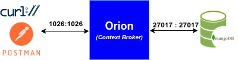

# Ejemplos de operaciones CRUD en NGSI-v2
A continuación vamos a ver ejemplos de las operaciones CRUD básicas para gestionar entidades en NGSI-v2. 

## Arquitectura de trabajo
Para probar los ejemplos de operaciones CRUD en NGSI-v2, utilizaremos el Context Broker Orion de Fiware desplegado mediante Docker. La siguiente imagen muestra la arquitectura de trabajo que utilizaremos para los ejemplos (ver [Figura 2](#fig:architecture)).

<a name="fig:architecture" ><figure>  
  
  <figcaption style="text-align: center; font-size: tiny;">Figura 2: Arquitectura de trabajo.</figcaption>
</figure></a> 

### Requisitos previos
Para seguir los ejemplos, es necesario tener instalado

- Un sistema operativo basado en Linux (Ubuntu, Debian, Fedora, CentOS, etc.) o Windows 10/11 con WSL2 y una distribución de Linux (Ubuntu recomendada).

- [Docker](https://docs.docker.com/get-docker/) y [Docker Compose](https://docs.docker.com/compose/install/). En el caso de utilizar Windows, debemos tener instalado [Docker Desktop](https://docs.docker.com/desktop/setup/install/windows-install/) y tener habilitada la opción "Use WLS2 instead of Hyper-V" en la Configuración. 
- Una herramienta para realizar peticiones HTTP, como [Postman](https://www.postman.com/) o [cURL](https://curl.se/). O el uso del [complemento REST Client](https://marketplace.visualstudio.com/items?itemName=humao.rest-client) de [Visual Studio Code](https://code.visualstudio.com/).

#### Obtención del software sistema
En nuestro caso, utilizaremos Docker Compose para desplegar el Context Broker Orion. El archivo `docker-compose.yml`  utilizado por Docker Compose se obtiene del repositorio GitHub [https://github.com/franciscodelicado/Fiware-CRUD-example.git](https://github.com/franciscodelicado/Fiware-CRUD-example.git). 

Así pues clonaremos dicho repositorio y nos situaremos en la carpeta `Fiware-CRUD-example`:

```bash
git clone https://github.com/franciscodelicado/Fiware-CRUD-example.git
cd Fiware-CRUD-example
git checkout initial-example
```

Una vez clonado se puede ver el contenido del archivo `docker-compose.yml`, que describe el servicio de Orion Context Broker, y la base de datos MongoDB utilizados para el despliegue de la arquitectura. Dicho archivo es el siguiente:

```yaml
services:
  # Orion is the context broker
  orion:
    labels:
      org.fiware: 'tutorial'
    image: fiware/orion:${ORION_VERSION}
    hostname: orion
    container_name: fiware-orion
    depends_on:
      - mongo-db
    networks:
      - default
    ports:
      - "${ORION_PORT}:${ORION_PORT}" # localhost:1026
    command: -dbhost mongo-db -logLevel DEBUG -noCache
    healthcheck:
      test: curl --fail -s http://orion:${ORION_PORT}/version || exit 1
      interval: 5s

  # Databases
  mongo-db:
    labels:
      org.fiware: 'tutorial'
    image: mongo:${MONGO_DB_VERSION}
    hostname: mongo-db
    container_name: db-mongo
    expose:
      - "${MONGO_DB_PORT}"
    ports:
      - "${MONGO_DB_PORT}:${MONGO_DB_PORT}" # localhost:27017 # localhost:27017
    networks:
      - default
    volumes:
      - mongo-db:/data
    healthcheck:
      test: |
        host=`hostname --ip-address || echo '127.0.0.1'`; 
        mongo --quiet $host/test --eval 'quit(db.runCommand({ ping: 1 }).ok ? 0 : 2)' && echo 0 || echo 1
      interval: 5s

networks:
  default:
    labels:
      org.fiware: 'tutorial'
    ipam:
      config:
        - subnet: 172.18.1.0/24

volumes:
  mongo-db: ~
```

Donde se observa como se definen dos servicios: `orion` (el Context Broker) y `mongo-db` (la base de datos MongoDB). Además, se exponen los puertos necesarios para acceder a estos servicios desde el host. Las variables de entorno `ORION_VERSION`, `ORION_PORT`, `MONGO_DB_VERSION` y `MONGO_DB_PORT` se definen en el archivo `.env` que se encuentra en la misma carpeta. 


### Arranque del sistema
Para arrancar el sistema, el repositorio incluye un _script_ de _shell_ llamado `services` cuya sintaxis es: **`./services <start|stop|create>`**. Este script permite obtener, arrancar y detener,  servicios "_dockerizados_" definidos en el archivo `docker-compose.yml`. Así pues, arrancaremos el sistema con el siguiente comando:

```bash
./services start
```

Una vez devuelto el control del terminal, se puede comprobar que los servicios están funcionando correctamente con el comando:

```bash
curl -X GET \
  'http://localhost:1026/version'
```

Que debería devolver una respuesta similar a la siguiente [^1]:

```json
HTTP/1.1 200 OK
Date: Tue, 30 Sep 2025 14:24:03 GMT
Connection: close
Fiware-Correlator: 1d48ce00-9e09-11f0-a9db-0242ac120103
Content-Type: application/json
Content-Length: 743

{
  "orion": {
    "version": "3.10.1",
    "uptime": "0 d, 0 h, 1 m, 5 s",
    "git_hash": "9a80e06abe7f690901cf1586377acec02d40e303",
    "compile_time": "Mon Jun 12 16:55:20 UTC 2023",
    "compiled_by": "root",
    "compiled_in": "buildkitsandbox",
    "release_date": "Mon Jun 12 16:55:20 UTC 2023",
    "machine": "x86_64",
    "doc": "https://fiware-orion.rtfd.io/en/3.10.1/",
    "libversions": {
      "boost": "1_74",
      "libcurl": "libcurl/7.74.0 OpenSSL/1.1.1n zlib/1.2.12 brotli/1.0.9 libidn2/2.3.0 libpsl/0.21.0 (+libidn2/2.3.0) libssh2/1.9.0 nghttp2/1.43.0 librtmp/2.3",
      "libmosquitto": "2.0.15",
      "libmicrohttpd": "0.9.76",
      "openssl": "1.1",
      "rapidjson": "1.1.0",
      "mongoc": "1.23.1",
      "bson": "1.23.1"
    }
  }
}
```

## Manejo de ENTIDADES
A continuación, veremos ejemplos de las operaciones CRUD básicas para gestionar entidades en NGSI-v2.

### CREA una entidad
Para crear una nueva entidad en NGSI-v2, se utiliza el método HTTP **POST** en el endpoint `/v2/entities`. El cuerpo de la solicitud debe contener la representación JSON de la entidad a crear.

En el caso que nos ocupa, la primera entidad que crearemos es un edificio, luego la petición será la siguiente:

```bash
curl -iX POST 'http://localhost:1026/v2/entities' \
-H 'Content-Type: application/json' \
-d '
{
  "id": "urn:ngsi-ld:Building:001",
  "type": "Building",
  "address":{
      "type": "PostalAddress",
      "value": {
          "streetAddress": "C/ Octavio Cuartero, 4",
          "addressLocality": "Albacete",
          "postalCode": "02001",
          "addressCountry": "Spain"
      }
  },
  "location": {
      "type": "geo:json",
      "value": {
          "type": "Point",
          "coordinates": [ -1.8570339054401495, 38.990913668029066]
      }   
  }
}'
```

La respuesta a esta petición, si todo ha ido bien, debería ser similar a la siguiente:

```
HTTP/1.1 201 Created
Date: Tue, 30 Sep 2025 14:40:43 GMT
Fiware-Correlator: 7180474e-9e0b-11f0-9c06-0242ac120103
Location: /v2/entities/urn:ngsi-ld:Building:001?type=Building
Content-Length: 0
```

que como indica el código de estado HTTP 201, la entidad se ha creado correctamente, y se puede acceder a ella mediante el "_endpoint_" `/v2/entities/urn:ngsi-ld:Building:001`.

### LEE una entidad
Así pues, si realizamos una petición **GET** a dicho "_endpoint_" deberíamos obtener la representación JSON de la entidad creada:

```bash
curl -X GET 'http://localhost:1026/v2/entities/urn:ngsi-ld:Building:001' | jq '.'
```

que devolvería una respuesta similar a la siguiente:

```json
{
  "id": "urn:ngsi-ld:Building:001",
  "type": "Building",
  "address": {
    "type": "PostalAddress",
    "value": {
      "streetAddress": "C/ Octavio Cuartero, 4",
      "addressLocality": "Albacete",
      "postalCode": "02001",
      "addressCountry": "Spain"
    },
    "metadata": {}
  },
  "location": {
    "type": "geo:json",
    "value": {
      "type": "Point",
      "coordinates": [
        -1.857033905,
        38.990913668
      ]
    },
    "metadata": {}
  }
}
```

Como se puede observar, este tipo de respuesta, llamada **normalizada**, incluye los atributos de la entidad, así como un campo `metadata` para cada atributo, que en este caso está vacío. Pero se NGSI-v2 también permite obtener respuestas:

- **No normalizadas**: que no incluyen el campo `metadata` para cada atributo. Para obtener este tipo de respuesta, se debe añadir el parámetro **`options=keyValues`** a la petición GET. Por ejemplo:
  ```bash
  curl -X GET 'http://localhost:1026/v2/entities/urn:ngsi-ld:Building:001?options=keyValues' | jq '.'
  ```
  que devolvería una respuesta similar a la siguiente:
  ```json
  {
    "id": "urn:ngsi-ld:Building:001",
    "type": "Building",
    "address": {
      "streetAddress": "C/ Octavio Cuartero, 4",
      "addressLocality": "Albacete",
      "postalCode": "02001",
      "addressCountry": "Spain"
    },
    "location": {
      "type": "Point",
      "coordinates": [
        -1.857033905,
        38.990913668
      ]
    }
  }
  ```
  en la que se observa que no se incluye el campo `metadata` para cada atributo.
- **Valores de atributos**: que solo incluyen el valor de los atributos, sin indicar su nombre ni tipo, ni el campo `metadata`. Para obtener este tipo de respuesta, se debe añadir el parámetro **`options=values`** a la petición GET. Por ejemplo:
  ```bash
  curl -X GET 'http://localhost:1026/v2/entities/urn:ngsi-ld:Building:001?options=values' | jq '.'
  ```
  que devolvería una respuesta similar a la siguiente:
  ```json
  [
    {
      "streetAddress": "C/ Octavio Cuartero, 4",
      "addressLocality": "Albacete",
      "postalCode": "02001",
      "addressCountry": "Spain"
    },
    {
      "type": "Point",
      "coordinates": [
        -1.857033905,
        38.990913668
      ]
    }
  ]
  ```
  en la que se observa que solo se incluye el valor de los atributos, sin el tipo ni el campo `metadata`.

  En este modo si se puede especificar la lista de atributos que queremos obtener mediante el parámetro **`attrs=<attr1>,<attr2>,...`**. Por ejemplo, si solo queremos obtener el valor del atributo `location`, la petición sería:
  ```bash
  curl -X GET 'http://localhost:1026/v2/entities/urn:ngsi-ld:Building:001?options=values&attrs=location' | jq '.'
  ```
  que devolvería una respuesta similar a la siguiente:
  ```json
  {
    "type": "Point",
    "coordinates": [
      -1.857033905,
      38.990913668
    ]
  }
  ``` 

## LEE múltiples entidades
NGSI-v2 también permite leer múltiples entidades mediante el endpoint `/v2/entities`. Por ejemplo, si primero añadimos otra entidad de edificio:

```bash
curl -iX POST 'http://localhost:1026/v2/entities' \
-H 'Content-Type: application/json' \
-d '
{
  "id": "urn:ngsi-ld:Building:002",
  "type": "Building",
  "address":{
      "type": "PostalAddress",
      "value": {
          "streetAddress": "C/ Mayor, 10",
          "addressLocality": "Madrid",
          "postalCode": "28013",
          "addressCountry": "Spain"
      }
  },
  "location": {
      "type": "geo:json",
      "value": {
          "type": "Point",
          "coordinates": [
            -3.705960302523467, 
            40.41669683428096
            ]
      }   
  }
}'
```

y luego realizamos una petición GET al endpoint **`/v2/entities`**:

```bash
curl -X GET 'http://localhost:1026/v2/entities?options=keyValues' | jq '.'
```

deberíamos obtener una respuesta similar a la siguiente:

```json
[
  {
    "id": "urn:ngsi-ld:Building:001",
    "type": "Building",
    "address": {
      "streetAddress": "C/ Octavio Cuartero, 4",
      "addressLocality": "Albacete",
      "postalCode": "02001",
      "addressCountry": "Spain"
    },
    "location": {
      "type": "Point",
      "coordinates": [
        -1.857033905,
        38.990913668
      ]
    }
  },
  {
    "id": "urn:ngsi-ld:Building:002",
    "type": "Building",
    "address": {
      "streetAddress": "C/ Mayor, 10",
      "addressLocality": "Madrid",
      "postalCode": "28013",
      "addressCountry": "Spain"
    },
    "location": {
      "type": "Point",
      "coordinates": [
          -3.705960303,
          40.416696834
        ]
    }
  }
]
```
que incluye todas las entidades de tipo `Building` que hay en el Context Broker.

### BORRAR una entidad
Para borrar una entidad, se utiliza el método HTTP **DELETE** sobre el endpoint correspondiente a la entidad que se desea eliminar. Por ejemplo, para borrar la entidad `Building:001`, se realizaría la siguiente petición:

```bash
curl -X DELETE 'http://localhost:1026/v2/entities/urn:ngsi-ld:Building:001'
```
Si todo ha ido bien, la respuesta es un códido de estado **`HTTP 204 (No Content)`**.

## Manejo de ATRIBUTOS
Ahora veremos ejemplos de las operaciones CRUD básicas para gestionar atributos de una entidad en NGSI-v2.

### LEE de atributos de una entidad
Para leer todos los atributos de una entidad, se utiliza el método HTTP **GET** sobre el endpoint **`v2/entities/<entity-id>/attrs`**. Por ejemplo, para leer todos los atributos de la entidad `Building:002`, se realizaría la siguiente petición:

```bash
curl -X GET 'http://localhost:1026/v2/entities/urn:ngsi-ld:Building:002/attrs?options=keyValues' | jq '.'
```

que devolvería una respuesta similar a la siguiente:

```json
{
  "address": {
    "streetAddress": "C/ Mayor, 10",
    "addressLocality": "Madrid",
    "postalCode": "28013",
    "addressCountry": "Spain"
  },
  "location": {
    "type": "Point",
    "coordinates": [
      -3.705960303,
      40.416696834
    ]
  }
}
```

que solo incluye los atributos de la entidad sin el campo `metadata` puesto que hemos utilizado el parámetro **`options=keyValues`**.

### LEE de un `<attr-name>` específico de una entidad
Para leer un atributo específico de una entidad, se utiliza el método HTTP **GET** sobre el endpoint **`v2/entities/<entity-id>/attrs/<attr-name>`**. Por ejemplo, para leer el atributo `address` de la entidad `Building:002`, se realizaría la siguiente petición:

```bash
curl -X GET 'http://localhost:1026/v2/entities/urn:ngsi-ld:Building:002/attrs/address' | jq '.'
```

que devolvería una respuesta similar a la siguiente:

```json
{
  "type": "PostalAddress",
  "value": {
    "streetAddress": "C/ Mayor, 10",
    "addressLocality": "Madrid",
    "postalCode": "28013",
    "addressCountry": "Spain"
  },
  "metadata": {}
}

```

### LEE del **valor** de un `<attr-name>` específico de una entidad
Para leer el valor de un atributo específico de una entidad, se utiliza el método HTTP **GET** sobre el endpoint **`v2/entities/<entity-id>/attrs/<attr-name>/value`**. Por ejemplo, para leer el valor del atributo `location` de la entidad `Building:002`, se realizaría la siguiente petición:

```bash
curl -X GET 'http://localhost:1026/v2/entities/urn:ngsi-ld:Building:002/attrs/location/value' | jq '.'
```

que devolvería una respuesta similar a la siguiente:

```json
{
    "type": "Point",
    "coordinates": [
      -3.705960303,
      40.416696834
    ]
}
```

### AÑADE/ACTUALIZA uno o más atributos de una entidad
Para añadir o actualizar uno o más atributos de una entidad, se utiliza el método HTTP **POST** sobre el endpoint **`v2/entities/<entity-id>/attrs`**. El cuerpo de la solicitud debe contener, en el cuerpo del mensaje, la representación JSON de los atributos a añadir o actualizar. Si el atributo ya existe, se actualizará su valor; si no existe, se añadirá como un nuevo atributo. Por ejemplo, para añadir un nuevo atributo `numberOfFloors` a la entidad `Building:002`, se realizaría la siguiente petición:

```bash
curl -iX POST 'http://localhost:1026/v2/entities/urn:ngsi-ld:Building:002/attrs' \
-H 'Content-Type: application/json' \
-d '
{
  "numberOfFloors": {
      "type": "Integer",
      "value": 5
  }
}'
```

La respuesta a esta petición, si todo ha ido bien, debería ser similar a la siguiente:

```
HTTP/1.1 204 No Content
Date: Wed, 01 Oct 2025 10:42:28 GMT
Connection: close
Fiware-Correlator: 535d8698-9eb3-11f0-88fa-0242ac120103
```

que como indica el código de estado HTTP 204, el atributo se ha añadido correctamente a la entidad. Si ahora leemos la entidad `Building:002`:

```bash
curl -X GET 'http://localhost:1026/v2/entities/urn:ngsi-ld:Building:002?options=keyValues' | jq '.'
```
```json
{
  "id": "urn:ngsi-ld:Building:002",
  "type": "Building",
  "address": {
    "streetAddress": "C/ Mayor, 10",
    "addressLocality": "Madrid",
    "postalCode": "28013",
    "addressCountry": "Spain"
  },
  "location": {
    "type": "Point",
    "coordinates": [
      -3.705960303,
      40.416696834
    ]
  },
  "numberOfFloors": 5
}
```

### ACTUALIZA el valor de atributos de una entidad
Para actualizar el valor de un atributo específico de una entidad, se utiliza el método HTTP **PATCH** sobre el endpoint **`v2/entities/<entity-id>/attrs/`**. El cuerpo de la solicitud debe contener el nombre del atributo a actualizar, junto con el nuevo valor. Por ejemplo:

```bash
curl -iX PATCH 'http://localhost:1026/v2/entities/urn:ngsi-ld:Building:002/attrs' \
-H 'Content-Type: application/json' \
-d '
{
  "numberOfFloors": {
      "value": 6
  },
    "location": {
      "value": {
          "type": "Point",
          "coordinates": [
            -3.706, 
            40.417
            ]
      }   
  }
}'
```

Modificará el contenido de la entidad de la siguiente forma:

```bash
curl -X GET 'http://localhost:1026/v2/entities/urn:ngsi-ld:Building:002?options=keyValues' | jq '.'
```
```json
{
  "id": "urn:ngsi-ld:Building:002",
  "type": "Building",
  "address": {
    "streetAddress": "C/ Mayor, 10",
    "addressLocality": "Madrid",
    "postalCode": "28013",
    "addressCountry": "Spain"
  },
  "location": {
    "type": "Point",
    "coordinates": [
      -3.706,
      40.417
    ]
  },
  "numberOfFloors": 6
}
```

### REEMPLAZA todos los atributos de una entidad
Para reemplazar todos los atributos de una entidad, se utiliza el método HTTP **PUT** sobre el endpoint **`v2/entities/<entity-id>/attrs`**. El cuerpo de la solicitud debe contener la representación JSON de los nuevos atributos que reemplazarán a los existentes. Por ejemplo, para reemplazar todos los atributos de la entidad `Building:002` con un nuevo conjunto de atributos, se realizaría la siguiente petición:

```bash
curl -iX PUT 'http://localhost:1026/v2/entities/urn:ngsi-ld:Building:002/attrs' \
-H 'Content-Type: application/json' \
-d '
{  "name": {
      "type": "Text",
      "value": "Edificio FRANMAN"
  },
  "numberFloors": {
      "type": "Integer",
      "value": 7
  },
  "area": {
      "type": "Number",
      "value": 635.5
  }
}'
```

Quedando el contenido de la entidad de la siguiente forma:

```bash
curl -X GET 'http://localhost:1026/v2/entities/urn:ngsi-ld:Building:002' | jq '.'
```
```json
{
  "id": "urn:ngsi-ld:Building:002",
  "type": "Building",
  "area": {
    "type": "Number",
    "value": 635.5,
    "metadata": {}
  },
  "name": {
    "type": "Text",
    "value": "Edificio FRANMAN",
    "metadata": {}
  },
  "numberFloors": {
    "type": "Integer",
    "value": 7,
    "metadata": {}
  }
}
```

### REEMPLAZA un atributo específico de una entidad
Para reemplazar un atributo específico de una entidad, se utiliza el método HTTP **PUT** sobre el endpoint **`v2/entities/<entity-id>/attrs/<attr-name>`**. El cuerpo de la solicitud debe contener la representación JSON del nuevo valor del atributo que reemplazará al existente. Por ejemplo, para reemplazar el atributo `area` de la entidad `Building:002`, se realizaría la siguiente petición:

```bash
curl -iX PUT 'http://localhost:1026/v2/entities/urn:ngsi-ld:Building:002/attrs/area' \
-H 'Content-Type: application/json' \
-d '
{
  "type": "Number",
  "value": 700.0,
  "metadata": {
      "unitCode": {
          "type": "Text",
          "value": "MTK"
      }
  }
}'
```

Lo que dará como resultado:

```bash
curl -X GET 'http://localhost:1026/v2/entities/urn:ngsi-ld:Building:002' | jq '.'
```
```json
{
  "id": "urn:ngsi-ld:Building:002",
  "type": "Building",
  "area": {
    "type": "Number",
    "value": 700,
    "metadata": {
      "unitCode": {
        "type": "Text",
        "value": "MTK"
      }
    }
  },
  "name": {
    "type": "Text",
    "value": "Edificio FRANMAN",
    "metadata": {}
  },
  "numberFloors": {
    "type": "Integer",
    "value": 7,
    "metadata": {}
  }
}
```

### ACTUALIZA el VALOR de un atributo específico de una entidad
Para actualizar el valor de un atributo específico de una entidad, se utiliza el método HTTP **PATCH** sobre el endpoint **`v2/entities/<entity-id>/attrs/<attr-name>/value`**. El cuerpo de la solicitud debe contener el nuevo valor del atributo que se desea actualizar. Por ejemplo, para actualizar el valor del atributo `name` de la entidad `Building:002`, se realizaría la siguiente petición:

```bash
curl -iX PATCH 'http://localhost:1026/v2/entities/urn:ngsi-ld:Building:002/attrs/name/value' \
-H 'Content-Type: text/plain' \
-d '
 "Edificio FRANMAN 2.0"
'
```

Lo que dará como resultado:

```bash
curl -X GET 'http://localhost:1026/v2/entities/urn:ngsi-ld:Building:002?options=keyValue' | jq '.'
```
```json
{
  "id": "urn:ngsi-ld:Building:002",
  "type": "Building",
  "area": {
    "type": "Number",
    "value": 700,
    "metadata": {
      "unitCode": {
        "type": "Text",
        "value": "MTK"
      }
    }
  },
  "name": {
    "type": "Text",
    "value": "Edificio FRANMAN 2.0",
    "metadata": {}
  },
  "numberFloors": {
    "type": "Integer",
    "value": 7,
    "metadata": {}
  }
}
``` 

**NOTA IMPORTANTE**: Hay que tener en cuenta que lo que va en el cuerpo del mensaje es el valor del campo `value` del atributo. Por lo que si este es un _string_ o un número el valor del parámetro de cabecera `Content-Type` debe ser `text/plain`; y el cuerpo del mensaje debe contener solo el _string_ (entre `"`), o el número en sí. En el caso de que el `value` sea un objeto JSON (p.e., si es de tipo `geo:json`), el valor del parámetro de cabecera `Content-Type` debe ser `application/json`, y en el cuerpo del mensaje debe ir el objeto JSON que conforma el `value`. De ahí que en el ejemplo anterior, como hemos actualizado un atributo cuyo `value` es un _string_ hemos utilizado `Content-Type: text/plain` y en el cuerpo del mensaje solo hemos puesto el _string_ `"Edificio FRANMAN 2.0"`.

### BORRA un atributo específico de una entidad
Para borrar un atributo específico de una entidad, se utiliza el método HTTP **DELETE** sobre el endpoint **`v2/entities/<entity-id>/attrs/<attr-name>`**. Por ejemplo, para borrar el atributo `name` de la entidad `Building:002`, se realizaría la siguiente petición:

```bash
curl -X DELETE 'http://localhost:1026/v2/entities/urn:ngsi-ld:Building:002/attrs/name'
```

Resultando:

```bash
curl -X GET 'http://localhost:1026/v2/entities/urn:ngsi-ld:Building:002' | jq '.'
```
```json
{
  "id": "urn:ngsi-ld:Building:002",
  "type": "Building",
  "area": {
    "type": "Number",
    "value": 700,
    "metadata": {
      "unitCode": {
        "type": "Text",
        "value": "MTK"
      }
    }
  },
  "numberFloors": {
    "type": "Integer",
    "value": 7,
    "metadata": {}
  }
}
```
